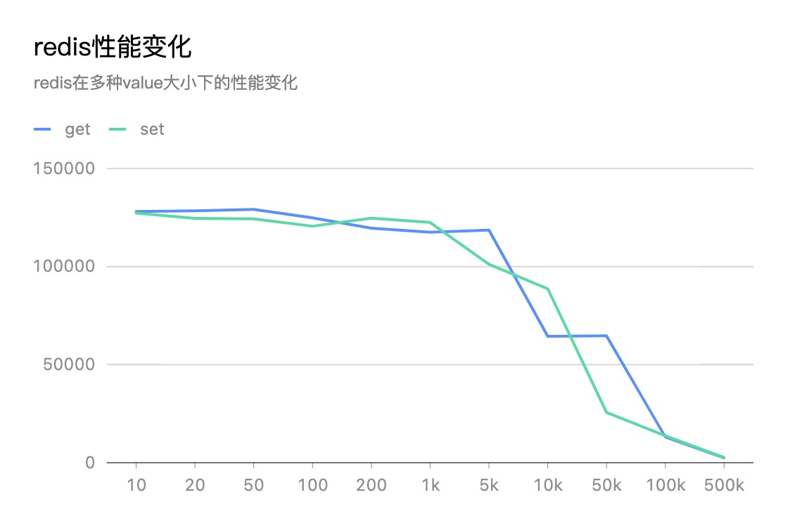

### Week05 作业题目：

1. 使用 redis benchmark 工具, 测试 10 20 50 100 200 1k 5k 字节 value 大小，redis get set 性能。
2. 写入一定量的 kv 数据, 根据数据大小 1w-50w 自己评估, 结合写入前后的 info memory 信息  , 分析上述不同 value 大小下，平均每个 key 的占用内存空间。
### 压测环境：
1. 网络：阿里云vpc内网
2. 机器：
   * redis机器 2c4g
   * 脚本执行机器 2c4g
### 压测结果：
1. 性能测试
```shell
redis-benchmark -h 172.16.200.72 -p 6379 -c 50 -n 1000000 -t get -d 10
131717.59 requests per secon
```
|  value字节数 | get/s  | set/s | 
|  ----  | ----  |---- |
| 10  | 128073 |127258 |
| 20  | 128468 |124564 |
| 50  | 129165 |124316 |
| 100  | 124843 |120598 |
| 200  | 119560 |124657 |
| 1K  | 117489 |122518 |
| 5K  | 118567 |101153 |
| 10K  | 64424 |88621 |
| 50K  | 64691 |25650 |
| 100K  | 13119 |13724 |
| 500K  | 2475 |2683 |



可见当前环境下，value大小超过5k字节，性能开始出现明显下降。

2. 内存评估

> fsd 通过info memory命令，查看内存相关占用，其中：
> 1 内部存储的所有数据内存占用量 used_memory_human
> 2 Redis 进程占用的物理内存总量 used_memory_rss_human

塞入10万个值

|  value字节数 | 数据占用 | redis占用 | 字节/keys | 
|  ----  | ----  |---- |---- |
| 10  | 10.93M |17.49M |114|
| 20  | 12.46M |17.56M |130|
| 50  | 15.51M |21.83M |162|
| 100  | 20.08M |25.27M |210|
| 200  | 30.77M |36.23M |322|
| 500  | 58.23M |65.43M |610|
| 1K  | 131.47M |139.40M |1377|
| 5K  | 790.62M |802.86M |8285|